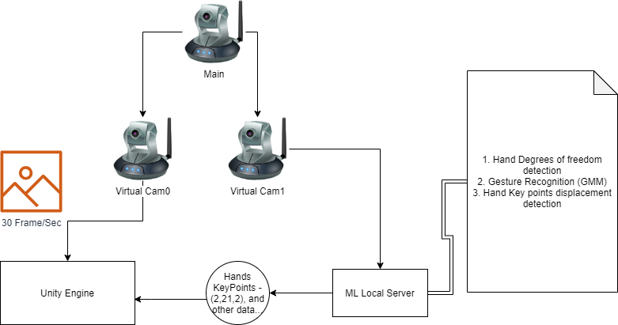

Virtual Board
A virtual board controlled by hand gestures.


## 📝 Table of Contents

- [Problem Statement](#problem_statement)
- [Idea / Solution](#solution)
- [Dependencies / Limitations](#limitations)
- [Future Scope](#future_scope)
- [Questions & Answers](#QA)
- [Setting up a local environment](#getting_started)
- [Usage](#usage)
- [Technology Stack](#tech_stack)
- [Authors](#authors)
- [Acknowledgments](#acknowledgments)

## Problem Statement <a name = "problem_statement"></a>


#### 1. Reality: 
Teachers need to use multiple screens to display the material and their selves.

#### 1. Ideal:
Allow the teachers to display all the materials and their selves in a smart way with just one monitor, and without having to use any extra solutions, like a green screen.


#### 2. Reality: 
Teachers are having a hard time making students more focused and interested during the online lecture. 

#### 2. Ideal:
Teachers should have a tool that allows them to grab the attention of students and make them more focused, without any effort on the teacher part.


## Idea / Solution <a name = "solution"></a>
- An application that enables the teachers to display both their camera feed and class material simultaneously with an intuitive input design, hands position and gestures, that allows the teacher to focus more on the teaching side and less on the technical side.


## ⛓️ Limitations <a name = "limitations"></a>

- Based on hand recognition, which is usually implemented on hardware optimized parts, to use it on every camera ***might*** require a bit of optimization.
## 🚀 Future Scope <a name = "future_scope"></a>


- [ ] Allow students to interact with teachers via the app
- [ ] Add attention mechanisms
- [ ] Convert the desktop app to a web app
- [ ] implement Brownian Motion to make objects displacement more natural


## 🙋‍♂️🙋‍♀️ Questions & Answers <a name = "QA"></a>

todo

## 🏁 Getting Started <a name = "getting_started"></a>


### Prerequisites

1. Unity 2019
2. Visual Studio 2019
3. Python 3.8
4. OBS, OBS-VirtualCam
### Installing

#### For ML Server (Assets/ML Server)

Install required libraries

OpenCV -  library of programming functions mainly aimed at real-time computer vision
```
pip install opencv-python

```
Mediapipe - the simplest way for researchers and developers to build world-class ML solutions and applications
```
pip install mediapipe

```
Scikit-learn - Simple and efficient tools for predictive data analysis in python
```
pip install -U scikit-learn

```

#### For OBS:
1. download OBS - https://obsproject.com/download
2. download OBS Virtual Camera - https://github.com/CatxFish/obs-virtual-cam/releases


#### For Unity:
- download unity 2019 - https://unity.com/
- everything is pretty much ready out of the box.


## 🎈 Usage <a name="usage"></a>



1. Setup a virtual camera from your main camera
2. Run Assets/ML Server/main/decodeFromLocal.py
3. Open the project in Unity and run s1.scene


## ⛏️ Built With <a name = "tech_stack"></a>

- [Unity](https://unity.com/) - World’s best real-time development platform.
- [Mediapipe](https://github.com/google/mediapipe) - the simplest way for researchers and developers to build world-class ML solutions and applications.
- [Scikit-learn](https://scikit-learn.org/stable/) - Simple and efficient tools for predictive data analysis in python.
## ✍️ Authors <a name = "authors"></a>

- [@bshara23](https://github.com/bshara23)
- [@ahmad-masalha](https://github.com/ahmad-masalha)
- [@aimanouda2309](https://github.com/aimanouda2309)

## 🎉 Acknowledgments <a name = "acknowledgments"></a>

Not one yet
